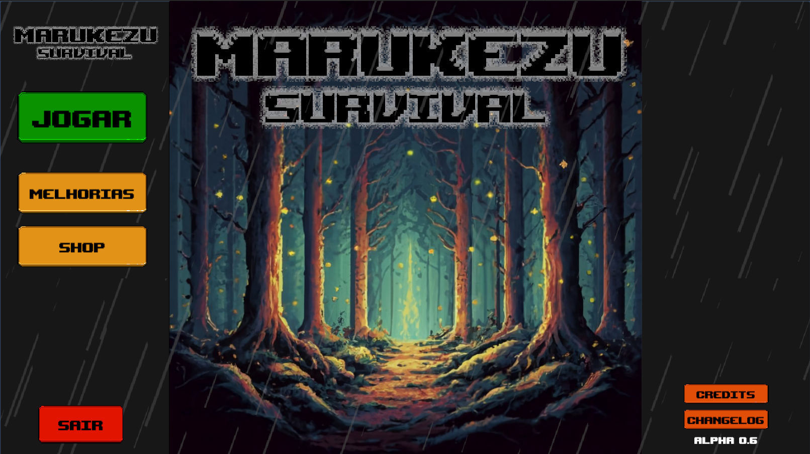
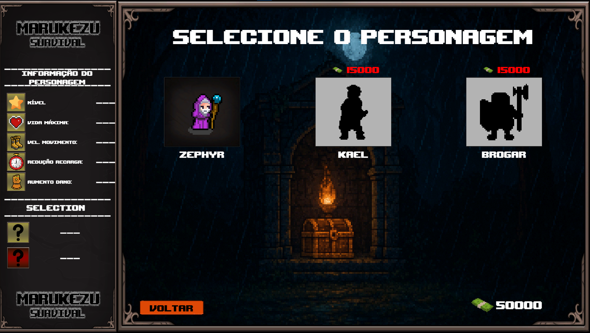
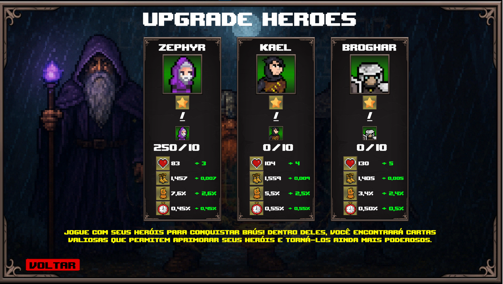
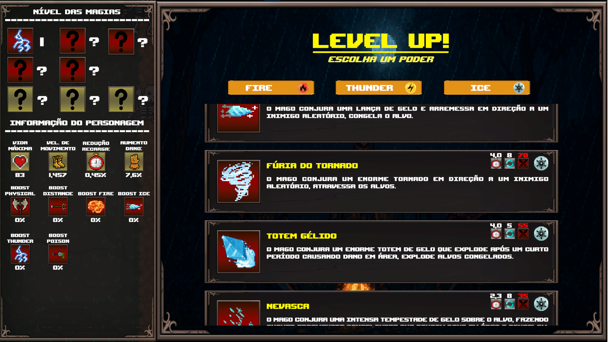
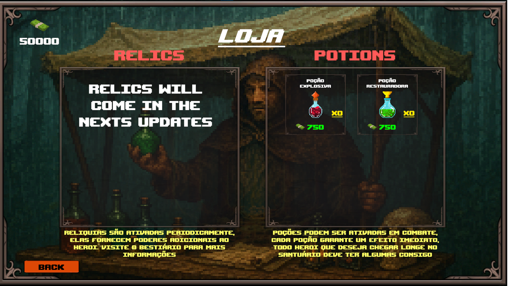

Marukezu Survival
Um rogue-like medieval de sobrevivência inspirado em Vampire Survivors

📖 Descrição

Marukezu Survival é um jogo rogue-like de sobrevivência, ambientado em uma floresta medieval chuvosa, onde hordas de criaturas avançam constantemente contra o jogador.
Seu único objetivo: sobreviver o máximo de tempo possível enquanto evolui habilidades, constrói builds poderosas e enfrenta eventos imprevisíveis.

O jogo foi desenvolvido na Unity (C#) e é parte do meu portfólio como desenvolvedor.
Ele conta com sistemas completos de habilidades, talentos, personagens, mapas, inimigos e eventos dinâmicos.

🧙 Personagens

Atualmente existem 3 personagens, sendo 2 jogáveis:

✔️ Zephyr — Mago (Desbloqueado)

Especialista em Fogo, Gelo e Raio

Pode misturar elementos livremente

Build depende da combinação entre habilidades + talentos escolhidos

✔️ Kael — Ladino (Desbloqueável)

Possui habilidades Físicas e à Distância

Estilo rápido e agressivo

❌ Broghar — Anão Guerreiro (Em desenvolvimento)

Ainda não possui habilidades implementadas

Não jogável por enquanto

👾 Inimigos

A floresta está repleta de ameaças:

Zumbis

Esqueletos

Morcegos

Lobos

Criatura-árvore

Bosses durante eventos

Todos os inimigos perseguem diretamente o jogador e causam dano ao encostar — como no Vampire Survivors.

🎮 Gameplay

Passeie livremente pela fase e sobreviva às ondas de inimigos

Suas habilidades são automáticas, ativando por tempo

Ao matar inimigos, eles dropam orbes de experiência

Após alguns segundos, os orbes são atraídos automaticamente para o jogador

Ao upar de nível, escolha novas habilidades e distribua 5 pontos de talento

  

🖼️ Galeria de Screenshots

   
 
   
 
  

🔥 Sistema de Habilidades

Cada personagem possui seu próprio conjunto de habilidades.

Zephyr

Domina três elementos:

🔥 Fogo — dano contínuo, explosões

❄️ Gelo — controle, lentidão

⚡ Raio — ataques rápidos, críticos

O jogador pode montar qualquer combinação desses elementos, criando builds únicas.

Kael

🏹 À distância

🗡️ Corpo a corpo (físico)

⭐ Sistema de Talentos

Após escolher a habilidade ao subir de nível, abre-se a árvore de talentos.
Você recebe 5 pontos para investir em bônus como:

Aumento de dano elemental (fogo/gelo/raio)

Aumento de dano físico

Maior velocidade de movimento

Redução de cooldown

Alcance dos ataques

Entre outros

Os talentos sinergizam com a build escolhida — builds bem montadas fazem enorme diferença.

🧪 Poções & Itens

Existem 2 poções que podem ser levadas para a partida:

Poção Explosiva: explode todos os inimigos ao redor

Poção de Cura: recupera vida gradualmente (tique a tique)

Máximo de 2 poções armazenadas por partida.

🗺️ Eventos Aleatórios

A cada 120–150 segundos, ocorre um evento aleatório:

Spawn de Boss

Aumento temporário da taxa de respawn dos inimigos

Novos eventos serão adicionados futuramente.

🎁 Baús & Sistema de Cartas

A cada 1 minuto vivo, o jogador ganha um baú.
Dentro dele há cartas, usadas para upar o nível do personagem na loja.

🏪 Loja de Upgrades (Menu Principal)

No menu principal existem:

Loja de cartas: evolui os personagens

Loja de poções: compra poções para usar na próxima run

🎵 Áudio

O jogo conta com:

Música ambiente

Efeitos sonoros

Tudo implementado diretamente na Unity.

🌍 Idiomas Disponíveis

O jogo possui suporte a dois idiomas:

🇧🇷 Português (Brasil) (100%)

🇺🇸 Inglês (90%)

O idioma pode ser selecionado ao iniciar o jogo.

💾 Sistema de Salvamento

O Marukezu Survival utiliza o sistema nativo PlayerPrefs da Unity para salvar os dados do jogador.
Isso inclui progresso de personagens, cartas obtidas, configurações e outros elementos de progressão.

O save é automático e ocorre sempre que o jogador realiza ações importantes, garantindo que o progresso não seja perdido ao fechar o jogo.

🛠️ Tecnologias Utilizadas

Unity (C#)

State Machines

Eventos aleatórios

Sistema de loot e XP

Arquitetura organizada para expansão futura

UI/UX Unity

Som & Partículas

🧩 Como Abrir o Projeto

Baixe ou clone o repositório

Abra a Unity Hub

Clique em Add Project

Selecione a pasta do repositório

Abra usando a versão recomendada da Unity (colocada em ProjectSettings/ProjectVersion.txt)

🚀 Roadmap

 Finalizar Broghar (Anão Guerreiro)

 Novos eventos dinâmicos

 Novas poções

 Novas áreas / mapas

 Novas armas e magias

 Sistema de progressão global permanente

 Mais bosses

📜 Licença

Todos os direitos reservados.
O código e os assets podem ser analisados e estudados, mas não podem ser usados, modificados, redistribuídos ou comercializados sem autorização.
