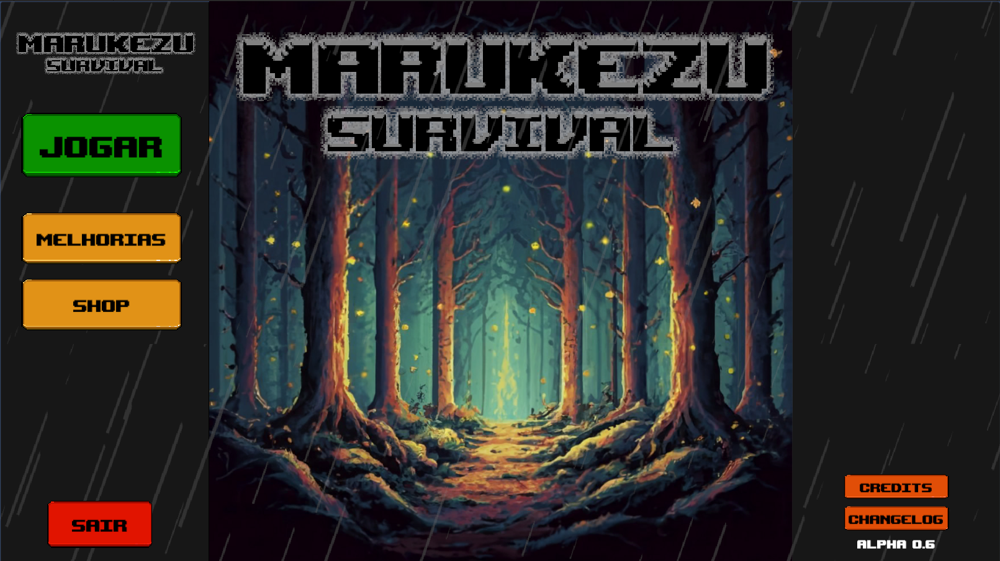
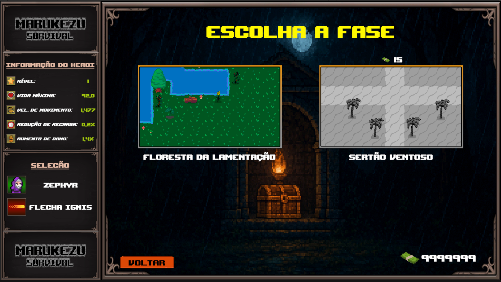
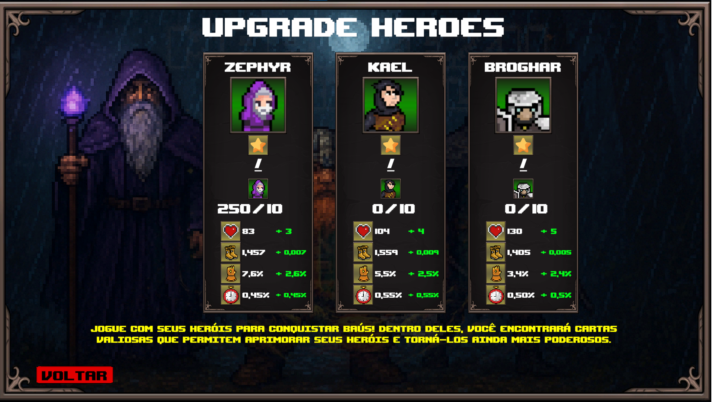
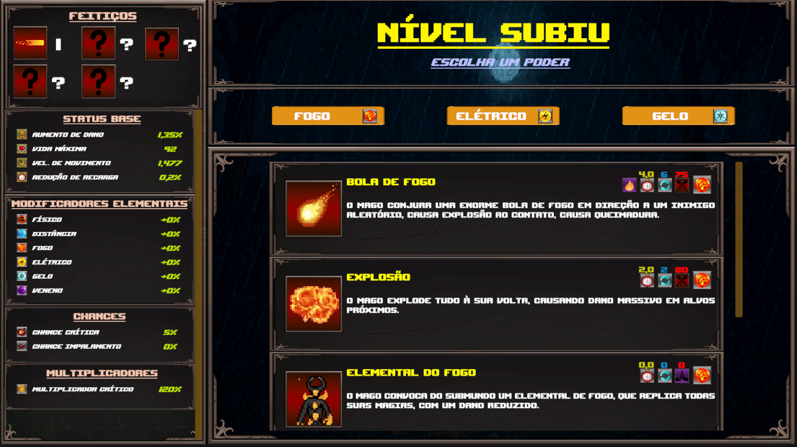
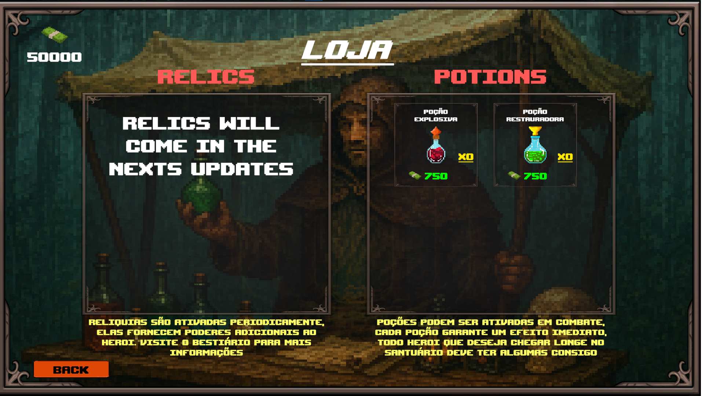

# 🏹 Marukezu Survival
### A Modular Medieval Rogue-Like Framework

Marukezu Survival é um rogue-like medieval de sobrevivência desenvolvido em Unity (C#), focado em arquitetura modular, sistemas escaláveis de habilidades e progressão dinâmica baseada em builds.

Inspirado na estrutura de jogos como Vampire Survivors, o projeto vai além da mecânica básica de sobrevivência ao explorar:

- Sistema de habilidades combináveis

- Árvore de talentos desacoplada

- Eventos dinâmicos temporizados

- Progressão baseada em cartas

- Sistema multilíngue integrado

- Estrutura preparada para expansão futura

- Este projeto faz parte do meu portfólio como estudo avançado de design de sistemas e arquitetura em Unity.

---

### 🎯 Objetivo do Projeto

O foco principal não é apenas a experiência jogável, mas a construção de um framework robusto para:

- Expansão modular de personagens

- Combinação dinâmica de habilidades

- Estrutura escalável de talentos

- Eventos randômicos controlados por tempo

- Progressão persistente entre runs

- Organização arquitetural preparada para crescimento

---

### 🎮 Gameplay

- Movimentação livre em mapa contínuo

- Habilidades automáticas baseadas em cooldown

- Inimigos perseguem constantemente o jogador

- Sistema de XP via orbes coletáveis

Ao subir de nível:

- Escolha uma nova habilidade

- Receba 5 pontos para distribuir na árvore de talentos

O objetivo é sobreviver o máximo possível enquanto constrói uma build eficiente.

  

🧙 Personagens

Atualmente existem 3 personagens (2 jogáveis):

- ✔️ Zephyr — Mago

Especialista em três elementos:

🔥 Fogo — dano contínuo e explosões

❄️ Gelo — controle e lentidão

⚡ Raio — ataques rápidos e críticos

Permite livre combinação de elementos, incentivando builds híbridas.

- ✔️ Kael — Ladino (Desbloqueável)

🏹 Ataques à distância

🗡️ Combate corpo a corpo

Estilo rápido e agressivo

- ❌ Broghar — Anão Guerreiro (Em desenvolvimento)

Planejado para foco em resistência e força bruta

Ainda não jogável

---

### 👾 Inimigos

- Zumbis

- Esqueletos

- Morcegos

- Lobos

- Criatura-árvore

- Bosses durante eventos

Todos os inimigos utilizam comportamento de perseguição direta e causam dano por contato (bosses possuem habilidades únicas).

---

### 🔥 Sistema de Habilidades

Cada personagem possui conjunto próprio de habilidades.

Características do sistema:

- Habilidades ativadas automaticamente por tempo

- Modularidade para expansão futura

- Separação entre lógica da habilidade e personagem

- Combinação livre entre elementos (no caso do Zephyr)

- O design permite criação de builds altamente distintas.

---

### ⭐ Sistema de Talentos

Ao subir de nível, o jogador acessa o painel de seleção de novas habilidades, podendo escolher entre os elementos disponívels do seu heroi. Em seguida, recebe acesso a árvore de talentos.

Cada nível concede 5 pontos de talento, que podem ser investidos em:

- Aumento nos status base do hero (pontos de vida, velocidade de movimento, dano base, redução de recarga de habilidades)

- Aumento de dano elemental

- Chances de acertos (Crítico/Empalamento)

- Multiplicadores das chances

- Outros modificadores estratégicos

O sistema foi projetado para incentivar sinergia entre habilidades e talentos.

---

### 🎁 Sistema de Cartas & Progressão

A cada 1 minuto sobrevivido, o jogador recebe um baú

Baús concedem cartas

Cartas são usadas na loja para evoluir personagens permanentemente

---

### 🏪 Loja (Menu Principal)

- Loja de Cartas (progressão permanente)

- Loja de Poções (itens para próxima run)

---

### 🧪 Poções

Cada run permite levar até 2 poções de cada tipo:

- 💥 Poção Explosiva — elimina inimigos próximos

- ❤️ Poção de Cura — regeneração gradual

Sistema preparado para expansão de novos consumíveis.

---

### 🗺️ Eventos Dinâmicos

A cada 120–150 segundos ocorre um evento aleatório:

- Spawn de Boss

- Aumento temporário da taxa de respawn

Estrutura modular permite adicionar novos eventos futuramente.

---

### 🌍 Sistema de Idiomas

O jogo possui sistema de localização com suporte atual para:

- 🇧🇷 Português (100%)

- 🇺🇸 Inglês (90%)

O idioma pode ser selecionado no início do jogo.

---

### 💾 Sistema de Salvamento

Utiliza o sistema nativo PlayerPrefs da Unity para armazenar:

- Progresso de personagens

- Cartas adquiridas

- Configurações

- Dados de progressão

O salvamento ocorre automaticamente após ações importantes.

---

### 🏗 Arquitetura do Projeto

O projeto foi estruturado com foco em organização e expansão:

- Separação clara entre lógica de combate e camada visual

- Sistema de habilidades modular

- Talentos desacoplados do personagem base

- Eventos temporizados independentes do loop principal

- Estrutura preparada para novos personagens e mapas

- Sistema de localização baseado em chave-valor

- Sistema de UI baseado em anchors e layout groups preparados para múltiplos aspect ratios (16:9, 18:9, 21:9)

---

### 🛠 Tecnologias Utilizadas

- Unity 2022.x
- C# orientado a objetos
- Arquitetura baseada em composição
- State Machines
- Sistema de eventos desacoplado
- Localização chave-valor
- UI responsiva com Canvas Scaler e Layout Groups

---

### 🖼️ Galeria

   
 
   
 
  

---

### 🚀 Roadmap

- Finalizar Broghar

- Novos eventos dinâmicos

- Novas poções

- Novas áreas / mapas

- Sistema de progressão global permanente

- Novos bosses

---

### 👨‍💻 Autor

Maurício Makimori
Desenvolvedor independente focado em sistemas escaláveis e prototipagem avançada em Unity.

GitHub: https://github.com/marukezu

Instagram: https://www.instagram.com/marukesu92/

---

### 📜 Licença

Todos os direitos reservados.
O código pode ser analisado para fins de estudo, mas não pode ser utilizado, modificado ou redistribuído sem autorização.
